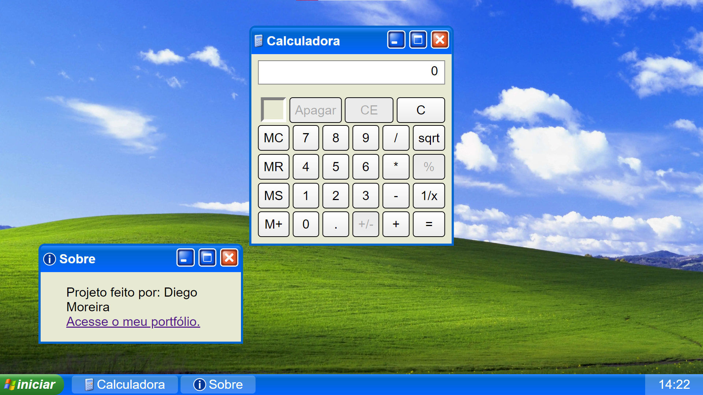

# Calculadora

Este é um projeto que imita a calculadora do Windows XP. O projeto foi proposto pelo site [The Odin Project](https://www.theodinproject.com) para aprendizado dos fundamentos de JavaScript e manipulação do DOM. O projeto pode ser acessado no link [diego-moreira8.github.io/odin-calculator-project](https://diego-moreira8.github.io/odin-calculator-project).

